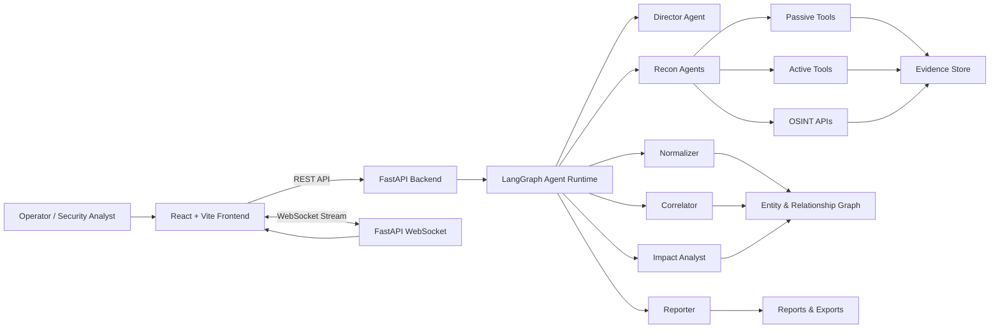
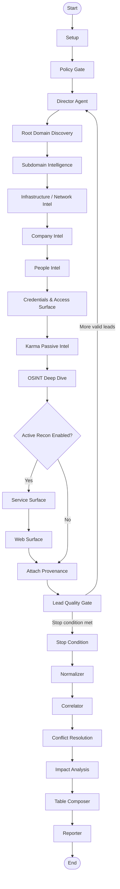

# MINA — Multi-Intelligence Network Agent


**MINA** stands for **Multi-Intelligence Network Agent**. It is a security reconnaissance and intelligence-assessment platform that combines a **FastAPI backend**, a **LangGraph-based multi-agent workflow**, and a **React/Vite cyber dashboard** to collect, normalize, correlate, visualize, and report network/security intelligence for an authorized target domain.

The project is designed as an academic and portfolio-grade cybersecurity system, focusing on structured reconnaissance, evidence tracking, graph-based entity relationships, scan profiles, real-time WebSocket updates, and multi-format reporting.

> **Important:** This project must only be used on domains, systems, and assets that you own or have explicit written permission to test.

---

## Table of Contents

- [Overview](#overview)
- [Key Features](#key-features)
- [Architecture](#architecture)
- [Agent Workflow](#agent-workflow)
- [Tech Stack](#tech-stack)
- [Project Structure](#project-structure)
- [Prerequisites](#prerequisites)
- [Environment Configuration](#environment-configuration)
- [Quick Start](#quick-start)
- [Manual Setup](#manual-setup)
- [API Overview](#api-overview)
- [Scan Profiles](#scan-profiles)
- [External Tool Support](#external-tool-support)
- [Testing](#testing)
- [Export Formats](#export-formats)
- [Security and Ethical Use](#security-and-ethical-use)
- [GitHub Upload Checklist](#github-upload-checklist)
- [Future Improvements](#future-improvements)

---

## Overview

MINA provides a practical workflow for turning a root domain into a structured security intelligence map.

The system can:

- Accept a root domain target from the web UI.
- Run a configurable multi-agent reconnaissance workflow.
- Collect passive and active intelligence depending on scan settings.
- Normalize raw observations into structured entities.
- Build relationships between domains, subdomains, IP addresses, services, endpoints, documents, repositories, and findings.
- Stream progress logs and discovered entities to the frontend in real time.
- Visualize the target surface as an interactive relationship graph.
- Generate Markdown, HTML, PDF, JSON, and CSV outputs.

MINA is especially suitable for:

- Cybersecurity academic projects.
- Authorized reconnaissance labs.
- Blue-team exposure mapping.
- Red-team preparation in controlled environments.
- Security automation and multi-agent workflow demonstrations.

---

## Key Features

### Multi-agent reconnaissance pipeline

MINA uses a LangGraph workflow with specialized agents for:

- Root domain discovery.
- Subdomain intelligence.
- Infrastructure and network intelligence.
- Company intelligence.
- People intelligence.
- Credentials and access-surface signals.
- Karma/Shodan-assisted passive intelligence.
- OSINT deep dive.
- Service-surface discovery.
- Web-surface discovery.
- Normalization, correlation, impact analysis, and report generation.

### Real-time cyber dashboard

The frontend provides:

- Target input panel.
- Agent enable/disable toggles.
- Scan profile selection: `quick`, `balanced`, `deep`.
- Wordlist profile selection: `small`, `medium`, `extended`.
- Real-time log terminal.
- Entity and vulnerability panels.
- Metrics dashboard.
- Interactive relationship graph powered by React Flow.
- Export buttons for final reports.

### Structured data model

The backend models scan output as:

- Raw events.
- Observations.
- Entities.
- Relationships.
- Findings.
- Impact insights.
- Evidence references.
- Phase logs.

This makes the system easier to extend compared with a simple one-shot scanner.

### Export-ready reports

MINA supports exporting intelligence and reports in multiple formats:

- JSON
- CSV
- Markdown
- HTML
- PDF
- Relationships CSV
- Vulnerabilities CSV

---

## Architecture



### Component responsibilities

| Component | Responsibility |
|---|---|
| `frontend/` | React/Vite dashboard, scan controls, graph visualization, live logs, export buttons |
| `backend/main.py` | FastAPI server, REST endpoints, WebSocket endpoint, scan session handling |
| `backend/core/graph.py` | LangGraph workflow construction and agent routing |
| `backend/agents/` | Specialized intelligence, recon, analysis, normalization, and reporting agents |
| `backend/tools/` | Tool adapters for DNS, certificates, web analysis, Shodan/Karma, reporting, documents, repositories |
| `backend/core/schemas/` | Typed Pydantic schemas for entities, leads, observations, findings, relationships, and events |
| `backend/export/` | Multi-format export helpers |
| `backend/tests/` | Unit and integration tests |

---

## Agent Workflow

The backend workflow is implemented with **LangGraph**. It starts from a target domain, passes through policy and planning stages, collects intelligence, validates leads, then produces normalized security reports.



---

## Tech Stack

### Backend

| Technology | Purpose |
|---|---|
| Python 3.11+ | Main backend runtime |
| FastAPI | REST API and WebSocket server |
| Uvicorn | ASGI server |
| LangGraph | Agentic workflow orchestration |
| LangChain / LangChain Core | LLM workflow support |
| OpenAI-compatible SDK | DeepSeek API integration |
| Pydantic / Pydantic Settings | Typed models and environment validation |
| Requests / dnspython / python-whois / Shodan SDK | Reconnaissance and OSINT collection |
| Pytest | Unit and integration testing |

### Frontend

| Technology | Purpose |
|---|---|
| React 18 | Frontend UI |
| Vite 5 | Development server and frontend build tool |
| React Flow / `@xyflow/react` | Tactical relationship graph visualization |
| CSS | Custom cyber-style dashboard design |

### Optional external tools

| Tool | Purpose |
|---|---|
| `subfinder` | Subdomain discovery |
| `httpx` | HTTP probing and web metadata collection |
| `nuclei` | Template-based vulnerability checks |
| `nmap` | Port/service discovery |
| Shodan API | Passive internet-exposure intelligence |

---

## Project Structure

```text
MINA/
├── backend/
│   ├── agents/                  # Multi-agent intelligence and analysis modules
│   ├── core/                    # Graph, config, state, schemas, validators, evidence store
│   │   └── schemas/             # Entity, finding, lead, observation, relationship schemas
│   ├── export/                  # Export helpers and schemas
│   ├── nodes/                   # Gate and workflow node helpers
│   ├── prompts/                 # Director, recon, normalization, and report prompts
│   ├── tests/                   # Unit and integration tests
│   ├── tools/                   # Recon, OSINT, reporting, DNS, cert, web, Shodan/Karma tools
│   │   └── adapters/            # Tool dispatcher and adapter layer
│   ├── wordlists/               # Subdomain and directory wordlists
│   ├── .env.example             # Backend environment template
│   ├── main.py                  # FastAPI application entry point
│   ├── requirements.txt         # Python dependencies
│   ├── pyproject.toml           # Project metadata and tooling config
│   └── pytest.ini               # Pytest configuration
│
├── frontend/
│   ├── src/
│   │   ├── components/          # UI panels and dashboard components
│   │   ├── hooks/               # WebSocket hook
│   │   ├── api/                 # Frontend API config helpers
│   │   ├── App.jsx              # Main application component
│   │   ├── App.css              # Dashboard styling
│   │   └── main.jsx             # React entry point
│   ├── .env.example             # Frontend environment template
│   ├── package.json             # Node dependencies and scripts
│   └── vite.config.js           # Vite configuration
│
├── huong_dan_chay_do_an.md      # Vietnamese run guide
├── start.ps1                    # Windows PowerShell auto-start script
├── toolchain.local.ps1          # Optional local toolchain override file
└── README.md
```

---

## Prerequisites

Install the following before running the project:

| Requirement | Version | Check command |
|---|---:|---|
| Python | 3.11+ | `python --version` |
| Node.js | 18+ | `node --version` |
| npm | Comes with Node.js | `npm --version` |
| PowerShell | 5.1+ for `start.ps1` | `$PSVersionTable.PSVersion` |

Optional tools for advanced active reconnaissance:

```bash
subfinder -version
httpx -version
nuclei -version
nmap --version
```

If optional tools are missing, MINA can still run the available parts of the pipeline, and `/api/tools/health` will report tool readiness.

---

## Environment Configuration

### Backend environment

Copy the backend environment template:

```powershell
cd backend
copy .env.example .env
```

For Linux/macOS:

```bash
cd backend
cp .env.example .env
```

Then edit `backend/.env`:

```env
DEEPSEEK_API_KEY=YOUR_DEEPSEEK_API_KEY_HERE
DEEPSEEK_BASE_URL=https://api.deepseek.com
DEEPSEEK_MODEL=deepseek-chat

SHODAN_API_KEY=YOUR_SHODAN_API_KEY_HERE
VIRUSTOTAL_API_KEY=YOUR_VIRUSTOTAL_API_KEY_HERE
SECURITYTRAILS_API_KEY=YOUR_SECURITYTRAILS_API_KEY_HERE

ENABLE_ACTIVE_RECON=false
ENABLE_KARMA_V2=false
ENABLE_SECRET_SCANNING=false
ENABLE_DOC_INTEL=false
ENABLE_REPO_INTEL=false
ENABLE_ENDPOINT_CRAWL=false

BACKEND_PORT=8000
FRONTEND_PORT=3000
```

### Environment variable notes

| Variable | Required | Purpose |
|---|---:|---|
| `DEEPSEEK_API_KEY` | Recommended | Enables LLM-assisted planning, OSINT reasoning, and severity classification |
| `DEEPSEEK_BASE_URL` | Optional | OpenAI-compatible DeepSeek API base URL |
| `DEEPSEEK_MODEL` | Optional | Default model name, usually `deepseek-chat` |
| `SHODAN_API_KEY` | Optional | Enables Shodan/Karma passive intelligence |
| `VIRUSTOTAL_API_KEY` | Optional | Reserved for enrichment workflows |
| `SECURITYTRAILS_API_KEY` | Optional | Reserved for passive DNS/security enrichment workflows |
| `ENABLE_ACTIVE_RECON` | Optional | Global active-recon feature flag |
| `BACKEND_PORT` | Optional | Backend port, default `8000` |
| `FRONTEND_PORT` | Optional | Frontend port, default `3000` |

### Frontend environment

Copy the frontend environment template:

```powershell
cd frontend
copy .env.example .env
```

For Linux/macOS:

```bash
cd frontend
cp .env.example .env
```

Default frontend config:

```env
VITE_API_BASE=http://localhost:8000
# VITE_WS_BASE=ws://localhost:8000
```

---

## Quick Start

### Recommended on Windows: use `start.ps1`

From the project root:

```powershell
.\start.ps1
```

The script automatically:

- Locates Python 3.11+ and Node.js 18+.
- Creates `backend/.env` from `.env.example` if missing.
- Creates `backend/.venv` if missing.
- Installs Python dependencies.
- Installs frontend npm dependencies.
- Checks whether the configured ports are free.
- Starts the backend in a separate PowerShell window.
- Starts the frontend.
- Opens the browser at the frontend URL.

### Useful script modes

```powershell
# Run backend only
.\start.ps1 -Mode backend-only

# Run frontend only
.\start.ps1 -Mode frontend-only

# Run tests only
.\start.ps1 -Mode test-only

# Skip dependency installation
.\start.ps1 -NoInstall

# Recreate virtual environment from scratch
.\start.ps1 -Bootstrap

# Use custom ports
.\start.ps1 -BackendPort 8001 -FrontendPort 3001
```

### Local toolchain override

Create `toolchain.local.ps1` in the project root if your Python or Node.js path is different:

```powershell
$MINA_PYTHON = "C:\Users\YourName\AppData\Local\Programs\Python\Python311\python.exe"
$MINA_NODE   = "C:\Program Files\nodejs\node.exe"
$MINA_BACKEND_PORT  = 8000
$MINA_FRONTEND_PORT = 3000
```

Do **not** commit `toolchain.local.ps1` to GitHub if it contains machine-specific paths.

---

## Manual Setup

### 1. Start the backend

```powershell
cd backend
python -m venv .venv
.venv\Scripts\Activate.ps1
pip install -r requirements.txt
python -m uvicorn main:app --host 0.0.0.0 --port 8000 --reload
```

Linux/macOS:

```bash
cd backend
python3 -m venv .venv
source .venv/bin/activate
pip install -r requirements.txt
python -m uvicorn main:app --host 0.0.0.0 --port 8000 --reload
```

Backend health check:

```text
http://localhost:8000/health
```

### 2. Start the frontend

Open another terminal:

```powershell
cd frontend
npm install
npm run dev
```

Then open:

```text
http://localhost:3000
```

---

## API Overview

| Method | Endpoint | Description |
|---|---|---|
| `GET` | `/` | Backend service status |
| `GET` | `/health` | Backend health and active session count |
| `GET` | `/api/version` | Build stamp and runtime information |
| `GET` | `/api/tools/health` | External tool readiness check |
| `POST` | `/api/scan/start` | Start a new scan |
| `GET` | `/api/scan/{scan_id}/status` | Get scan status |
| `GET` | `/api/scan/{scan_id}/results` | Get final structured scan results |
| `GET` | `/api/scan/{scan_id}/report` | Get Markdown report |
| `GET` | `/api/scan/{scan_id}/export/{fmt}` | Export report/data |
| `GET` | `/api/scans` | List in-memory scan sessions |
| `WS` | `/ws/{scan_id}` | Real-time scan event stream |

### Example scan request

```json
{
  "target": "example.com",
  "company_name": "Example Company",
  "allowed_scope": ["example.com"],
  "out_of_scope": [],
  "active_recon_enabled": false,
  "rate_limit": 2.0,
  "max_depth": 2,
  "max_iterations": 10,
  "scan_profile": "quick",
  "wordlist_profile": "small",
  "report_detail": "detailed"
}
```

Start a scan with `curl`:

```bash
curl -X POST http://localhost:8000/api/scan/start \
  -H "Content-Type: application/json" \
  -d '{
    "target": "example.com",
    "allowed_scope": ["example.com"],
    "active_recon_enabled": false,
    "scan_profile": "quick",
    "wordlist_profile": "small"
  }'
```

---

## Scan Profiles

| Profile | Intended use | Typical behavior |
|---|---|---|
| `quick` | Fast passive reconnaissance | DNS, WHOIS, certificate transparency, reverse DNS style sources |
| `balanced` | Normal assessment workflow | Passive sources plus light web/service enrichment |
| `deep` | Full authorized assessment | More collectors, deeper web surface analysis, optional active checks |

### Wordlist profiles

| Profile | Purpose |
|---|---|
| `small` | Fast tests and demos |
| `medium` | Balanced enumeration |
| `extended` | Deeper enumeration when authorized |

---

## External Tool Support

MINA can integrate with optional command-line tools. The backend exposes tool readiness through:

```text
GET /api/tools/health
```

Supported health checks include:

| Tool | Purpose |
|---|---|
| `subfinder` | Subdomain enumeration |
| `httpx` | HTTP probing and metadata collection |
| `nuclei` | Safe/controlled vulnerability template checks |
| `nmap` | Network service discovery |
| `karma_v2` / Shodan SDK | Passive internet exposure intelligence |

For GitHub portfolio usage, document which tools were enabled during your demo instead of implying every scan always uses every tool.

---

## Testing

Run all backend tests:

```powershell
cd backend
.venv\Scripts\Activate.ps1
python -m pytest tests/ -v
```

Linux/macOS:

```bash
cd backend
source .venv/bin/activate
python -m pytest tests/ -v
```

Run unit tests only:

```bash
python -m pytest tests/unit/ -v -m unit
```

Run integration tests only:

```bash
python -m pytest tests/integration/ -v -m integration
```

Test coverage areas in the project include:

- Identity and canonicalization.
- Planner behavior.
- Pydantic schema safety.
- Runtime event emission.
- Tool toggle wiring.
- Web tool behavior.
- Report generation.
- Normalizer and quality gates.
- Integration scan flow.

---

## Export Formats

MINA supports the following export formats through:

```text
GET /api/scan/{scan_id}/export/{fmt}
```

| Format | Endpoint suffix | Output |
|---|---|---|
| JSON | `json` | Entities, relationships, vulnerabilities |
| CSV | `csv` | Entity inventory table |
| Markdown | `md` | Markdown security report |
| HTML | `html` | Styled HTML report |
| PDF | `pdf` | Basic PDF report |
| Relationships CSV | `relationships-csv` | Relationship edge table |
| Vulnerabilities CSV | `vulnerabilities-csv` | Finding/vulnerability table |

---

## Security and Ethical Use

This project is for **authorized security research and academic demonstration only**.

Do:

- Scan only assets you own or have explicit permission to assess.
- Keep active reconnaissance disabled for demos against public third-party domains.
- Use `quick` profile for safe passive demonstrations.
- Keep API keys in `.env`, not in source code.
- Add rate limits and scope controls before running deeper profiles.
- Review generated findings manually before treating them as confirmed vulnerabilities.

Do not:

- Scan random public targets without permission.
- Use active modules against systems outside the approved scope.
- Commit `.env`, API keys, tokens, scan results, or private evidence to GitHub.
- Present OSINT guesses as verified facts without evidence.

---

## GitHub Upload Checklist

Before pushing this repository to GitHub, verify the following:

### Remove local/private files

Do **not** commit:

```text
backend/.env
backend/.venv/
backend/venv/
backend/output/
frontend/.env
frontend/node_modules/
toolchain.local.ps1
__pycache__/
.pytest_cache/
.DS_Store
```

### Suggested `.gitignore`

```gitignore
# Python
__pycache__/
*.py[cod]
.pytest_cache/
.mypy_cache/
.ruff_cache/
.venv/
venv/
backend/.venv/
backend/venv/
backend/output/
backend/*.db
backend/*.sqlite

# Environment files
.env
*.env
backend/.env
frontend/.env
toolchain.local.ps1

# Node / Vite
node_modules/
frontend/node_modules/
frontend/dist/
*.local

# Logs
*.log
logs/

# OS / editor
.DS_Store
Thumbs.db
.vscode/
.idea/

# Generated reports / evidence
*.pdf
*.html
intel_*.json
report_*.md
relationships_*.csv
vulnerabilities_*.csv
```

### Secret check

Run a quick search before publishing:

```bash
grep -RInE "(api[_-]?key|secret|token|password|sk-)" . \
  --exclude-dir=.git \
  --exclude-dir=node_modules \
  --exclude-dir=.venv
```

If any real secret was committed before, rotate/revoke it immediately.

---

## Limitations

- Some advanced enrichment depends on external APIs and API keys.
- Active reconnaissance depends on optional tools installed on the host system.
- In-memory scan sessions are not suitable for long-term production storage.
- LLM-generated reasoning should be manually reviewed.
- Network results can vary depending on DNS, rate limits, tool availability, and target defenses.
- PDF export is intentionally lightweight and may not preserve advanced styling.

---

## Future Improvements

Potential improvements for future versions:

- Persistent database storage for scan sessions and evidence.
- Authentication and role-based access control for the dashboard.
- Docker Compose deployment.
- More granular scope policy enforcement.
- Better report templating and branded PDF output.
- CI pipeline for backend tests and frontend build.
- Integration with additional OSINT sources.
- Safer active-recon presets for enterprise environments.
- Historical comparison between scans.
- Risk trend dashboard.

---

## Learning Outcomes

This project demonstrates practical knowledge of:

- Agentic security automation.
- LangGraph workflow design.
- FastAPI backend engineering.
- WebSocket-based real-time systems.
- React dashboard development.
- Cyber reconnaissance methodology.
- Entity normalization and relationship graph modeling.
- Security reporting and evidence-based analysis.
- Responsible tool gating and scope-aware scanning.

---

## Disclaimer

MINA is provided for educational and authorized security assessment purposes only. The authors and contributors are not responsible for misuse, unauthorized scanning, policy violations, or damage caused by improper use of this project.
